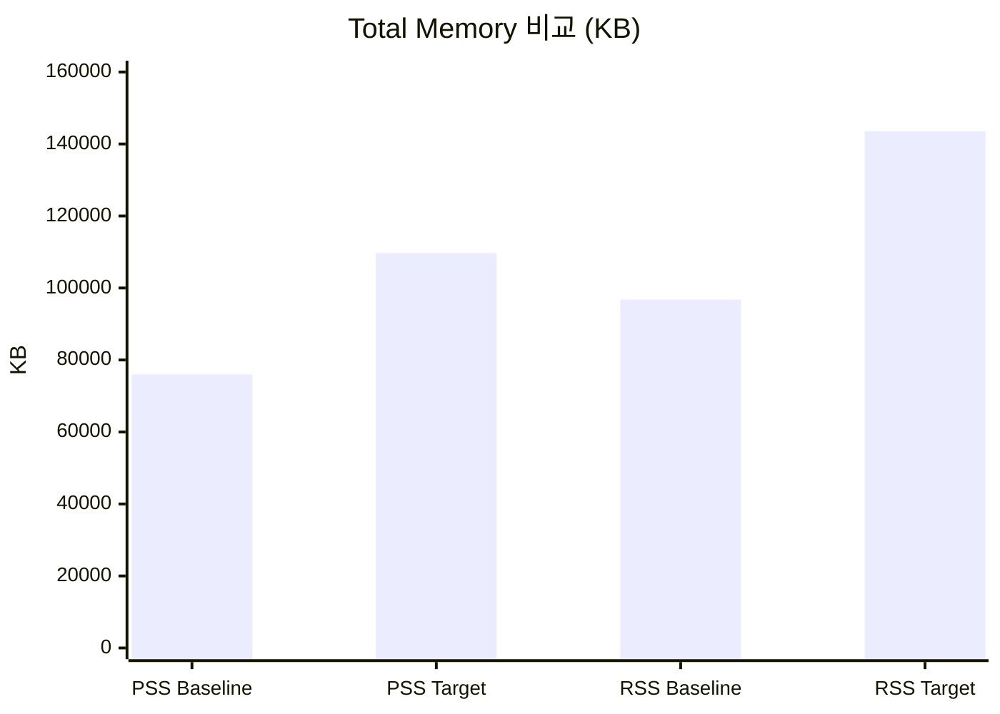
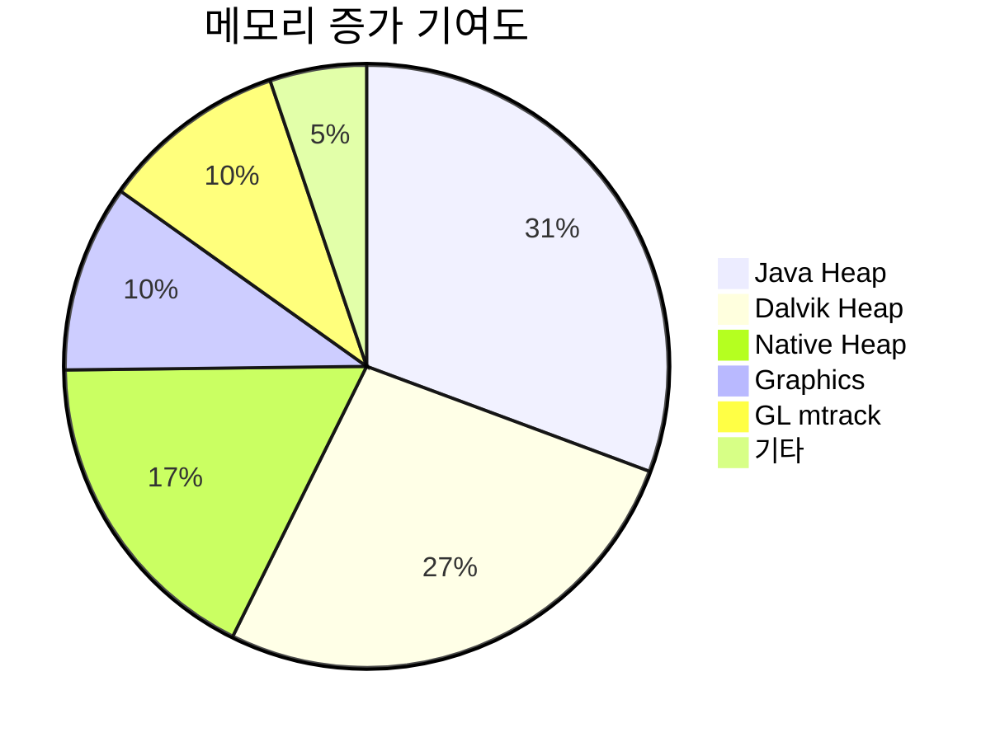
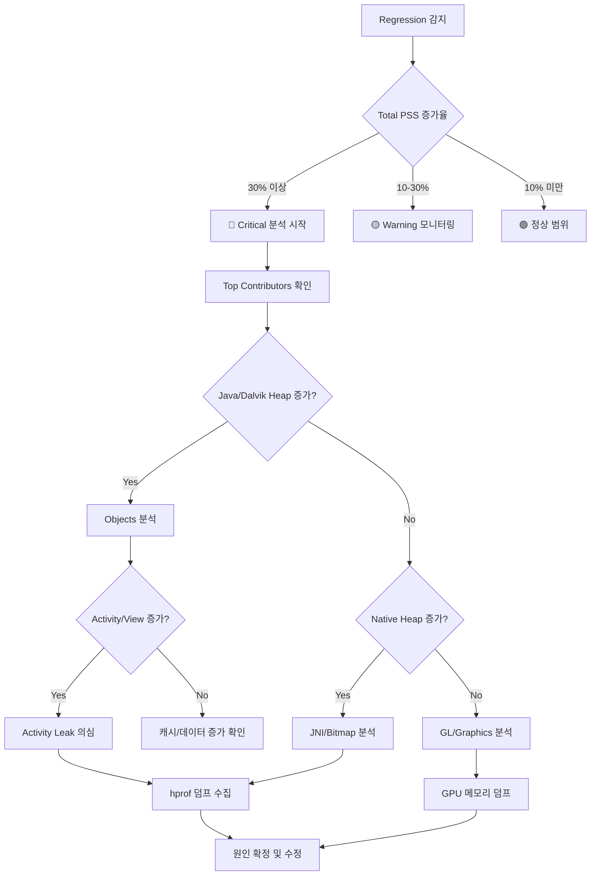

# SystemUI Memory Regression 분석 보고서 (시각화 템플릿)

> 이 파일은 report/generator.py가 생성할 최종 보고서의 시각화 템플릿입니다.
> mkdocs-material의 Mermaid 렌더링으로 별도 이미지 관리 없이 차트가 표시됩니다.
> Cline은 이 템플릿을 참고하여 report/generator.py의 출력에 시각화를 통합하세요.

**생성일시:** 2026-04-28
**Baseline:** S948NKSU2AZDD (3회 평균)
**Target:** S948NKSU2AZDE (3회 평균)
**심각도:** 🔴 Critical

---

## 1. 전체 요약

| 지표 | Baseline | Target | 변화량 | 변화율 |
|------|----------|--------|--------|--------|
| **Total PSS** | 76,009 KB | 109,700 KB | +33,691 KB | +44.3% |
| **Total RSS** | 96,780 KB | 143,524 KB | +46,744 KB | +48.3% |

### Total PSS / RSS 비교 차트



---

## 2. 메모리 증가 주요 원인 (Top Contributors)

| 순위 | 영역 | 증가량 (KB) | 증가율 | 심각도 |
|------|------|-------------|--------|--------|
| 1 | Java Heap | +18,915 | +73.5% | 🔴 Critical |
| 2 | Dalvik Heap | +16,447 | +73.5% | 🔴 Critical |
| 3 | Native Heap | +10,787 | +70.8% | 🔴 Critical |
| 4 | Graphics | +6,200 | +30.3% | 🟡 Warning |
| 5 | GL mtrack | +6,144 | +50.0% | 🟡 Warning |

### 메모리 증가 기여도



---

## 3. 섹션별 상세 비교

### Baseline vs Target 섹션별 비교

```mermaid
xychart-beta
    title "섹션별 PSS 비교 (KB)"
    x-axis ["Native Heap", "Dalvik Heap", "GL mtrack", ".so mmap", ".art mmap", "Stack"]
    y-axis "KB" 0 --> 45000
    bar [15234, 22456, 12288, 8234, 3456, 512]
    bar [25890, 38912, 18432, 10234, 5678, 768]
```



---

## 4. Objects 변화

| 항목 | Baseline | Target | 변화량 | 심각도 |
|------|----------|--------|--------|--------|
| Views | 456 | 900 | +444 | 🟡 Warning |
| ViewRootImpl | 3 | 5 | +2 | 🟢 Info |
| Activities | 0 | 2 | +2 | 🟡 Warning |
| AppContexts | 12 | 18 | +6 | 🟢 Info |
| Local Binders | 234 | 312 | +78 | 🟢 Info |
| Proxy Binders | 89 | 145 | +56 | 🟢 Info |

---

## 5. AI 원인 분석

> 이 섹션은 Agent Builder(LLM)의 응답이 삽입되는 위치입니다.

### 가설 1: Activity Leak (신뢰도: 높음 🔴)

**현상:** Activities 0 → 2, Views 456 → 900 (약 2배 증가)

**분석:**
Activity 수가 0에서 2로 증가한 것은 SystemUI에서 비정상적입니다.
SystemUI는 일반적으로 Activity를 직접 실행하지 않으며, 이는 특정 설정 화면이나
다이얼로그가 destroy되지 않고 남아있을 가능성을 시사합니다.
View 수의 급격한 증가는 이 leak된 Activity에 연결된 View hierarchy가
GC되지 않고 있음을 의미합니다.

**확인 방법:**
```bash
# Activity 상태 확인
adb shell dumpsys activity activities | grep systemui

# View hierarchy 확인
adb shell dumpsys SurfaceFlinger --list | grep systemui
```

### 가설 2: Bitmap/Drawable 캐시 과다 (신뢰도: 중간 🟡)

**현상:** Native Heap +10,787KB, GL mtrack +6,144KB

**분석:**
Native Heap과 GL mtrack이 동시에 크게 증가한 것은 이미지 리소스
(Bitmap, Drawable)가 과도하게 캐싱되고 있을 가능성을 나타냅니다.
특히 알림 패널의 아이콘이나 배경 이미지가 해제되지 않는 경우 이 패턴이 관찰됩니다.

**확인 방법:**
```bash
# Bitmap 할당 확인
adb shell dumpsys meminfo com.android.systemui -d | grep -A 20 "Asset Allocations"

# GPU 메모리 확인
adb shell dumpsys gpu --gpumem
```

### 가설 3: 알림 채널/미디어 세션 누수 (신뢰도: 낮음 🟢)

**현상:** Proxy Binders 89 → 145 (+63%), Death Recipients 23 → 34 (+48%)

**분석:**
Binder 객체의 증가는 서비스 바인딩이 정상적으로 해제되지 않을 때 발생합니다.
미디어 세션이나 알림 리스너가 해제되지 않으면 이 패턴이 나타날 수 있습니다.

**확인 방법:**
```bash
# Binder 상태 확인
adb shell dumpsys activity services com.android.systemui

# 알림 리스너 확인
adb shell dumpsys notification | grep -A 5 "NotificationListeners"
```

---

## 6. 조치 권고

| 우선순위 | 조치 항목 | 확인 대상 | 담당 |
|----------|-----------|-----------|------|
| 🔴 1순위 | Activity Leak 확인 | WindowManager, ActivityManager dump | - |
| 🔴 2순위 | View hierarchy 분석 | hprof 덤프 → MAT 분석 | - |
| 🟡 3순위 | Bitmap 캐시 정책 확인 | ImageLoader, 알림 아이콘 관리 | - |
| 🟢 4순위 | Binder leak 확인 | Service binding 라이프사이클 | - |

---

## 7. 조사 흐름도



---

## 8. 분석자 기록 (Human-in-the-loop)

> 아래 항목은 분석자가 직접 기록합니다.

| 항목 | 내용 |
|------|------|
| **실제 원인** | (AI 가설 중 맞은 것, 또는 실제 원인 기록) |
| **원인 코드 변경** | (문제를 유발한 commit/CL 정보) |
| **해결 조치** | (어떻게 수정했는지) |
| **추가 확인 데이터** | (hprof, systrace 등 추가로 확인한 것) |
| **카테고리** | (예: View Leak / Bitmap Cache / Service Binding) |
| **AI 정확도** | (AI 가설이 맞았는지 평가: 정확 / 부분 정확 / 부정확) |

---

*이 보고서는 SystemUI Analyzer + Agent Builder에 의해 자동 생성되었습니다.*
